# 📱 `android` — LearnCast Android Application

This is the Android-specific part of the LearnCast project. It contains two Gradle modules: `learncast` (the application entry point) and `lib` (the shared Android UI library). All business logic, data, and ViewModels live in the `shared` KMP module — this layer is purely concerned with presenting that logic on Android using Jetpack Compose.

**Main package root:** `me.anasmusa.learncast`

---

## 📋 Table of Contents

1. [Module Overview](#1-module-overview)
2. [Tech Stack at a Glance](#2-tech-stack-at-a-glance)
3. [Module: `learncast` (App)](#3-module-learncast-app)
4. [Module: `lib` (UI Library)](#4-module-lib-ui-library)
5. [Application Bootstrapping](#5-application-bootstrapping)
6. [Navigation](#6-navigation)
7. [Theme & Design System](#7-theme--design-system)
8. [Screens](#8-screens)
9. [Reusable Components](#9-reusable-components)
10. [Notifications & Background Services](#10-notifications--background-services)
11. [Localization (String Resources)](#11-localization-string-resources)
12. [Build Configuration & Variants](#12-build-configuration--variants)
13. [Package Structure](#13-package-structure)

---

## 1. Module Overview

The `android` folder contains two Gradle modules that together form the complete Android application:

| Module | Type | Responsibility |
|---|---|---|
| `android/learncast` | `com.android.application` | Entry point — wires up the theme, configures `AppConfig`, and launches `MainActivity` |
| `android/lib` | `com.android.library` | All UI: screens, components, navigation, theme, services, and the `App` root composable |

The `learncast` app module is intentionally thin. It depends on `lib`, which in turn declares an `api` dependency on the `shared` KMP module, making the full shared layer available to any screen.

---

## 2. Tech Stack at a Glance

| Concern | Library / Tool |
|---|---|
| UI framework | Jetpack Compose (Material3 Expressive) |
| Navigation | AndroidX Navigation 3 (`navigation3-runtime`, `navigation3-ui`) |
| Image loading | Coil 3 + OkHttp fetcher |
| Dependency injection | Koin Compose (`koin-compose`, `koin-compose-viewmodel`, `koin-compose-viewmodel-navigation`) |
| Glass / blur effects | Haze |
| Analytics & crash reporting | Firebase Analytics + Firebase Crashlytics |
| Push notifications | Firebase Cloud Messaging (FCM) |
| Background sync | WorkManager (via `SyncWorker` in `shared`) |
| In-app updates | Google Play In-App Update API |
| Player session | Media3 Session (`androidx.media3.session`) |
| Palette-based theming | AndroidX Palette |
| Paging UI | Paging 3 Compose (`paging-compose`) |
| Serialization | kotlinx.serialization (for nav key encoding) |
| Linting | ktlint |

---

## 3. Module: `learncast` (App)

**Gradle namespace:** `me.anasmusa.learncast`  
**Application ID:** `me.anasmusa.learncast`  
**Min SDK:** from `libs.versions.android.minSdk`  
**Target SDK:** from `libs.versions.android.targetSdk`

This module contains the minimum code needed to launch the app. It has three responsibilities: configure `AppConfig`, apply the Material theme, and hand off to the `App` composable from `lib`.

### `ApplicationLoader`

**Package:** `me.anasmusa.learncast.app`

Extends `lib`'s abstract `ApplicationLoader`. Its sole job is to call `AppConfig.update(...)` before `super.onCreate()` runs, injecting all environment-specific values:

| Parameter | Value |
|---|---|
| `appName` | `"LearnCast"` |
| `apiBaseUrl` | `https://api.anasmusa.me/learncast/` |
| `publicBaseUrl` | `https://learncast.anasmusa.me` |
| `telegramBotId` | `8538344134L` |
| `googleClientId` | Google OAuth web client ID |
| `mainLogo` | `R.drawable.logo` |
| `transparentLogo` | `R.drawable.logo_transparent` |

### `MainActivity`

**Package:** `me.anasmusa.learncast.app`

Extends `lib`'s abstract `Activity`. Sets Compose content using `MaterialExpressiveTheme` with `darkScheme`, `MontserratTypography`, and the app-level `backgroundColors` / `playerBackgroundColors` gradient lists, then renders `App(...)`.

### Local Theme (`app/ui/theme/`)

The `learncast` module defines its own sealed color palette on top of the `lib` theme, adding two gradient lists consumed only by `MainActivity`:

- `backgroundColors` — two-stop dark gradient used as the main screen background
- `playerBackgroundColors` — two-stop gradient used as the player's default background before a palette color is extracted from the album art

---

## 4. Module: `lib` (UI Library)

**Gradle namespace:** `me.anasmusa.learncast.lib`

This module contains everything visual: all screens, reusable components, the navigation graph, the theme, foreground services, and FCM handling. It is designed to be reusable — a separate flavour app (e.g. a white-label build) could depend on `lib` and supply its own `AppConfig` without modifying any UI code.

The module's `build.gradle.kts` also registers a `copyStringsToAndroid` Gradle task that copies string XML files from `shared/src/commonMain/resources` into `lib/src/main/assets/` before every build, ensuring the Android `Resource` system always reads the same string definitions as the shared KMP module.

---

## 5. Application Bootstrapping

### Abstract `ApplicationLoader`

**Package:** `me.anasmusa.learncast.lib.core`  
**Extends:** `me.anasmusa.learncast.ApplicationLoader` (from `shared`)

Performs three tasks on `onCreate()`:

1. Updates `AppConfig` with download notification string resource IDs from `lib`'s own string resources
2. Starts Koin with `getModules()` — the full Koin graph from the `shared` module
3. Configures `SingletonImageLoader` (Coil 3) with an OkHttp fetcher and a placeholder/error image taken from `appConfig.mainLogoInt`

### Abstract `Activity`

**Package:** `me.anasmusa.learncast.lib`  
**Extends:** `ComponentActivity`

Handles all one-time setup that every concrete `Activity` in the app needs:

- Calls `enableEdgeToEdge()` and sets light-on-dark status and navigation bar appearance
- Creates three Android notification channels: `sync-worker` (background sync), `news` (push notifications), and `app-updates`
- Enqueues `SyncWorker` via WorkManager so background sync runs even if the app is killed
- Registers an `ActivityResultLauncher` for in-app update flows and checks for available updates using the Play In-App Update API; requests an **immediate update** if the app is more than 7 days stale, or a **flexible update** if 1–7 days stale

### `AppEnvironment` / `LocalAppEnvironment`

**Package:** `me.anasmusa.learncast.lib.core`

A `CompositionLocal` that carries `HazeState`, `backgroundColors`, and `playerBackgroundColors` down the composition tree. Injected once at the root by `ProvideAppEnvironment(...)` in `App.kt` and consumed in any composable via `LocalAppEnvironment.current`.

---

## 6. Navigation

**Package:** `me.anasmusa.learncast.lib.nav`  
**Library:** AndroidX Navigation 3 (`NavDisplay`, `NavBackStack`, `NavEntry`, `entryProvider`)

### `Screen`

A `sealed class` implementing `NavKey`. Each destination is a `@Serializable` `data object` or `data class`:

| Destination | Type | Parameters |
|---|---|---|
| `Entrance` | object | — (splash/loading placeholder) |
| `Login` | object | — |
| `Home` | object | — |
| `Snips` | object | — |
| `Profile` | object | — |
| `TopicList` | object | — |
| `Topic` | data class | `topic: Topic` |
| `AuthorList` | object | — |
| `Author` | data class | `author: Author` |
| `Search` | data class | `authorId: Long`, `topicId: Long?`, `selectedTab: Int` |
| `StorageUsageScreen` | object | — |

### `NavController`

A lightweight wrapper around `NavBackStack<NavKey>` exposing `navigate(Screen)` and `popBack()`. Provided via `LocalNavController` (`staticCompositionLocalOf`) and injected into any composable via `ProvideNavController(backStack) { ... }`.

### `EntryProvider` (`entryProvider()`)

Registers all screen destinations using the Navigation 3 `entryProvider { ... }` DSL. Notable transition overrides:

- `Home`, `Snips`, `Profile` — no animation (tab switches are instant)
- `Search` — enters with a fade + scale-in, exits with a fade + scale-out (modal feel)
- All other screens — horizontal slide-in/slide-out (300 ms tween), with predictive back support

### `App` Root Composable

**File:** `me.anasmusa.learncast.lib.App`

Manages the top-level state machine:

- Observes `AppViewModel.state` for `isLoggedIn`
- Maintains a `selectedPage` (`Screen.Home` / `Screen.Snips` / `Screen.Profile`) with three independent `NavBackStack`s — each tab remembers its own back stack
- The `PlayerScreen` is rendered inside the `Scaffold`'s `bottomBar` slot using an `AnchoredDraggableState` with two anchors (`"expanded"` / `"collapsed"`). The navigation bar slides off-screen when the player is expanded, computed by offsetting the `NavigationBar` by `min(maxPosition − offset, 80 + windowInset) dp`
- Loads localized strings via `Resource.setLocale("uz")` before rendering any UI
- Requests `POST_NOTIFICATIONS` permission on first login (Android 13+)
- Applies a Haze blur effect to the navigation bar using `hazeEffect` + `hazeSource`

---

## 7. Theme & Design System

**Package:** `me.anasmusa.learncast.lib.theme`

### Color Scheme

The app is dark-only — there is no light theme. `darkScheme` defines a full set of dark green/blue-grey color tokens.

### Typography (`MontserratTypography`)

All Material3 text styles are overridden with the **Montserrat** font family in three weights — Regular, Medium, Bold — loaded from `res/font/`. The function returns a full `Typography` copy covering all 15 standard + 15 expressive emphasized styles.

### Icon System (`theme/icon/`)

All icons are custom `ImageVector` objects defined as Kotlin files. There is no dependency on Material Icons Extended — every icon used in the app is hand-authored.

### Utility Functions (`core/Utils.kt`)

- `backgroundBrush()` — returns a `Brush.verticalGradient` from `LocalAppEnvironment.current.backgroundColors` capped at 250 dp, used on every screen's root `Modifier.background(...)`
- `formatTime(seconds: Int)` / `formatTime(mSeconds: Long)` — formats durations as `MM:SS` or `H:MM:SS`
- `BOTTOM_PADDING = 144` — standard content bottom padding (accounts for nav bar + mini player height)

### Color Utilities (`core/Color.kt`)

- `Int.darken(amount: Float): Color` — shifts HSV saturation up and brightness down for the player palette extraction
- `Int.lighten(amount: Float): Color` — shifts HSV brightness up

---

## 8. Screens

All screens follow the same pattern: a public composable (e.g. `HomeScreen()`) obtains the ViewModel via `koinViewModel<>()`, collects state, and delegates to a private `_HomeScreen(...)` composable that takes plain parameters. This keeps previews easy and the public composable free of logic.

**Package root:** `me.anasmusa.learncast.lib.screen`

### Auth

**`LoginScreen`** — Full-screen login page with a gradient background, a large app logo, and two sign-in buttons (Telegram, Google). Errors are shown via a `SnackbarHost`. Tapping "Continue with Telegram" opens a `ModalBottomSheet` containing `TelegramLoginScreen`.

**`TelegramLoginScreen`** — A `WebView` that loads the Telegram OAuth widget at `https://oauth.telegram.org/auth?bot_id=...`. Intercepts the result URL redirect (whose fragment contains the base64-encoded auth hash) via `WebViewClient.shouldOverrideUrlLoading`. A `JavascriptInterface` (`AndroidCancelHandler`) is also injected to detect when the user taps the Telegram cancel button. JavaScript injection (`injectCancelInterceptor`) overrides `window.loginCancel` and adds a document-level click listener to catch the cancel button click before the WebView handles it natively.

### Home

**`HomeScreen`** — `LazyColumn` of `LessonCell` items backed by Paging 3. Features a collapsing `TopAppBar` (using `enterAlwaysScrollBehavior`) containing: Authors and Topics navigation buttons, a live search field (`SearchButton`), and a horizontal row of `FilterChip` components for the `Filters` enum (`Latest`, `In Progress`, `Favourite`, `Downloads`, `Most Snipped`). Pull-to-refresh is implemented with `PullToRefreshBox`. The list source applies `hazeSource` so the navigation bar blur has content to sample.

### Author

**`AuthorListScreen`** — Paginated grid/list of authors with search, navigates to `AuthorScreen` on tap.

**`AuthorScreen`** — Detail view for a single author: shows their topics and lessons, with a "Play all" action that fills the queue with all lessons for that author.

### Topic

**`TopicListScreen`** — Paginated list of topics with optional author filter.

**`TopicScreen`** — Detail view for a single topic, showing lessons filtered by that topic. Supports "Play all".

### Search

**`SearchScreen`** — A combined search across authors, topics, and lessons (tab-based), launched from `Home` or `Author`. Uses the `SearchViewModel` from the `shared` module. Enters with a scale + fade animation.

### Player

**`PlayerScreen`** — The main audio player, rendered persistently in the `App`'s `Scaffold` bottom bar slot using `AnchoredDraggableState`. The player occupies the full screen height when expanded and collapses to a 64 dp mini strip.

Key details:
- `ratio = draggableState.offset / draggableState.anchors.maxPosition()` drives all size/alpha transitions
- Album art is loaded via Coil 3 and fed into `Palette` to extract a vibrant colour, which replaces the default gradient. The colour is `lighten(0.3f)` for the top stop and `darken(0.8f)` for the bottom stop
- The `CollapsedPlayer` mini-bar shows at `ratio >= 0.8f` with `alpha = 1 - (1 - ratio) / 0.2f`
- Full player shows playback controls (Replay 10 s, Play/Pause, Forward 30 s), a seek slider, position/duration labels, a Create/Update Snip button, and a snip-count badge
- Sub-screens (Queue, PlayerSnip) are shown inside an `AnimatedVisibility` overlay using `slideInVertically` / `slideOutVertically`

**`BottomPlayer`** — A standalone mini-player composable (separate from `PlayerScreen`'s collapsed state), used in other contexts where only a compact now-playing row is needed.

**`QueueScreen`** — Shows the current playback queue as a reorderable `LazyColumn` using `DragDropState`. Each item has swipe-to-dismiss and a context action sheet (`QueueActionSheet`).

**`PlayerSnipScreen`** — Lists all snips for the currently playing lesson, accessible from the player's snip count badge.

### Snip

**`SnipListScreen`** — Paginated list of all the user's snips across all lessons, with debounced search. Tapping a snip adds it to the queue.

**`SnipEditScreen`** — A `ModalBottomSheet` for creating or editing a snip. Contains:
- A `TimeRangeSelector` for picking start and end points within the audio
- A `TextField` for an optional note (max 128 characters)
- Play / Stop preview controls (via a dedicated `SnipEditViewModel` audio player instance)
- Save button that calls `SnipRepository.save(...)` via the ViewModel
- Uses a local `ViewModelStore` so the `SnipEditViewModel` is scoped to this sheet instance and is destroyed when dismissed

### Profile

**`ProfileScreen`** — Displays the logged-in user's avatar (loaded with Coil), name, and email/username. Contains a Storage Usage button (navigates to `StorageUsageScreen`) and a Sign Out button that shows a confirmation bottom sheet before calling `ProfileViewModel`.

**`StorageUsageScreen`** — Shows cache and download sizes (formatted as MB/GB strings from `StorageViewModel`). Provides "Clear Cache" and "Clear Downloads" buttons, each with a `ConfirmationBottomSheet`.

---

## 9. Reusable Components

**Package:** `me.anasmusa.learncast.lib.component`

| Component | Description |
|---|---|
| `PrimaryButton` | Icon + label button used for Authors/Topics/Storage navigation. Accepts an `ImageVector`, a string key, optional padding and spacing overrides, and a `clip` flag |
| `SearchButton` | Inline search field that toggles between a compact search icon and an expanded `TextField`. Used in `HomeScreen` and `AuthorScreen` |
| `QueueButton` | Circular icon button with a badge count overlay. Used in the player and the collapsed mini-player |
| `SheetMenuButton` | Full-width tappable row used inside bottom sheets (player action sheet, queue action sheet) |
| `ConfirmationBottomSheet` | Generic confirmation sheet with a title, message, positive button, and dismiss. Used for logout, clear-cache, and clear-downloads confirmations |
| `Loader` | Full-screen semi-transparent overlay with a `CircularProgressIndicator` — shown during async operations |
| `SnackBarHost` | Thin wrapper around `SnackbarHost` with a styled `Snackbar` |
| `TimeRangeSelector` | Custom seek range control for the snip editor. Combines a `RangeSlider` (minute-resolution) with two `TimeSpinner` `LazyRow` scroll pickers (second-resolution). The spinners use `SnapFlingBehavior` and `snapshotFlow` to keep the slider and spinners in sync bidirectionally. A red dot marks the current playback position |
| `DragDropState` / `rememberDragDropState` | Drag-and-drop reorder state for `LazyColumn`. Detects touch start, computes item swaps by midpoint overlap, and auto-scrolls via a `Channel<Float>` when dragging near the viewport edge |

### List Cell Components (`component/cell/`)

| Cell | Usage |
|---|---|
| `LessonCell` | 80 dp thumbnail + author name, title/topic concatenation, date and duration. Used in `HomeScreen`, `AuthorScreen`, `TopicScreen` |
| `AuthorCell` | Author avatar, name, and lesson/topic counts |
| `TopicCell` | Topic thumbnail and title |
| `SnipCell` | Snip timestamp range, note preview, and action overflow |
| `QueueItemCell` | Queue position indicator, thumbnail, title, drag handle, and swipe-to-remove target |

---

## 10. Notifications & Background Services

### FCM Service (`FCMService`)

**Package:** `me.anasmusa.learncast.lib.core.notification`  
**Extends:** `FirebaseMessagingService`

Handles incoming FCM pushes in `onMessageReceived`. For each notification:

1. Parses the notification payload for title, body, image URL, and channel ID
2. If an image URL is present, loads it synchronously via Coil 3 (`executeBlocking`) at 112 px
3. Builds a `NotificationCompat.Builder` with `BigPictureStyle` if an image was loaded, otherwise plain text
4. Creates a `PendingIntent` for `learncast://notification` deep-link (handled by `MainActivity`)
5. Posts the notification to the channel specified in the payload (defaults to `"news"`)

### Android Manifest Services (in `lib`)

| Service | Type | Purpose |
|---|---|---|
| `PlaybackService` (from `shared`) | `foregroundServiceType="mediaPlayback"` | Media3 `MediaSessionService` for ExoPlayer playback control and lock-screen/notification controls |
| `AndroidDownloadService` (from `shared`) | `foregroundServiceType="dataSync"` | Media3 `DownloadService` for background audio downloads; restarts automatically via `RESTART` intent filter |
| `FCMService` | standard | Firebase messaging |

### Permissions (in `lib` manifest)

- `FOREGROUND_SERVICE`
- `FOREGROUND_SERVICE_MEDIA_PLAYBACK`
- `FOREGROUND_SERVICE_DATA_SYNC`
- `POST_NOTIFICATIONS`

---

## 11. Localization (String Resources)

The `lib` module does not use the standard Android `res/values/strings.xml` for app content strings. Instead, it reads from XML files in `src/main/assets/`:

- `strings.xml` — English strings
- `strings-uz.xml` — Uzbek strings

These are the same files that live in `shared/src/commonMain/resources/` and are copied into the `assets/` directory by the `copyStringsToAndroid` Gradle task at build time. The shared `Resource` object parses them via `parseStringsXml(...)` and serves them to all composables via `Resource.string()` extension calls on string constant keys (e.g. `Strings.HOME.string()`).

The `res/values/strings.xml` in `lib` contains only system-facing strings (download notification labels referenced by `AppConfig`).

---

## 12. Build Configuration & Variants

### `learncast` module

| Build Type | Application ID Suffix | Notes |
|---|---|---|
| `debug` | `.debug` | Signed with `keystores/debug.jks` |
| `release` | none (or `.dev` if `environment=dev` property set) | R8 minification + resource shrinking enabled; ProGuard rules in `proguard-rules.pro` |

Version name is `"1.0.0"` with an optional suffix from the `versionNameSuffix` Gradle property (used by Fastlane CI builds).

### `lib` module

Crashlytics collection is toggled by the `crashlyticsEnabled` Gradle property (defaults to `true`). The value is injected into the manifest via `manifestPlaceholders["crashlyticsCollectionEnabled"]`.

### Plugins used across both modules

- `com.android.application` / `com.android.library`
- `org.jetbrains.kotlin.plugin.compose` (Compose compiler)
- `com.google.gms.google-services` (Firebase, app module only)
- `com.google.firebase.crashlytics` (app module only)
- `org.jetbrains.kotlin.plugin.serialization` (lib module)
- `org.jlleitschuh.gradle.ktlint`

---


## 13. Package Structure

```
android/
├── learncast/                         # :android:learncast — Application module
│   ├── keystores/
│   └── src/main/
│       └── kotlin/me/anasmusa/learncast/app/
│           └── ui/theme/
│
└── lib/                               # :android:lib — UI Library module
    └── src/main/
        ├── assets/                    # Localized string XML files (copied from shared/commonMain)
        ├── res/
        │   ├── font/                  # Montserrat font variants
        │   ├── drawable-*/            # Density-bucketed logo drawables
        │   └── values/
        └── kotlin/me/anasmusa/learncast/lib/
            ├── core/
            │   └── notification/
            ├── nav/
            ├── theme/
            │   └── icon/              # Custom ImageVector icons
            ├── component/
            │   ├── drag/
            │   └── cell/
            └── screen/
                ├── auth/
                ├── author/
                ├── home/
                ├── player/
                │   ├── queue/
                │   └── snip/
                ├── profile/
                ├── snip/
                └── topic/
```

### App
<div>
  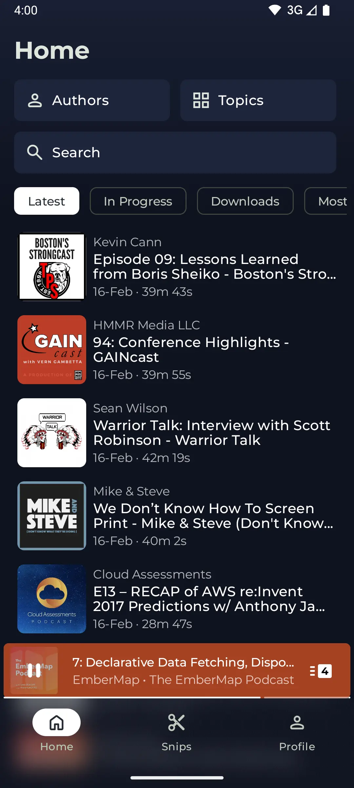
  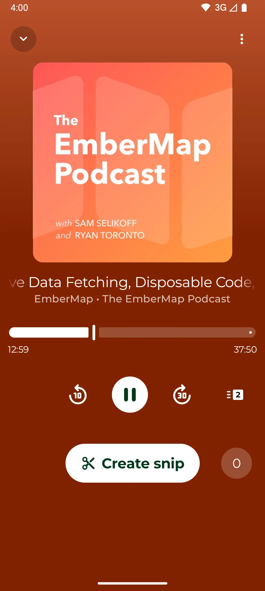
  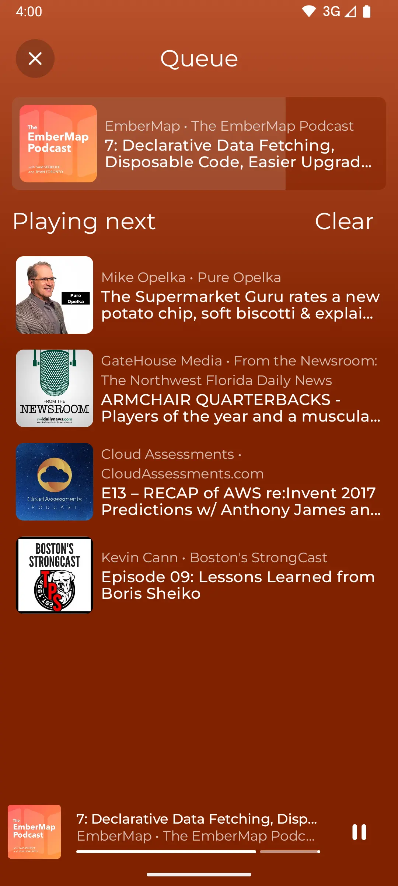
  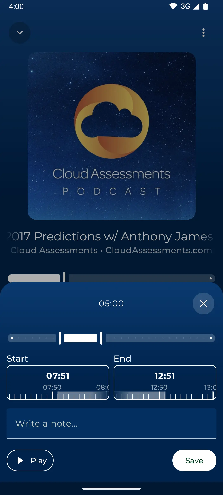
  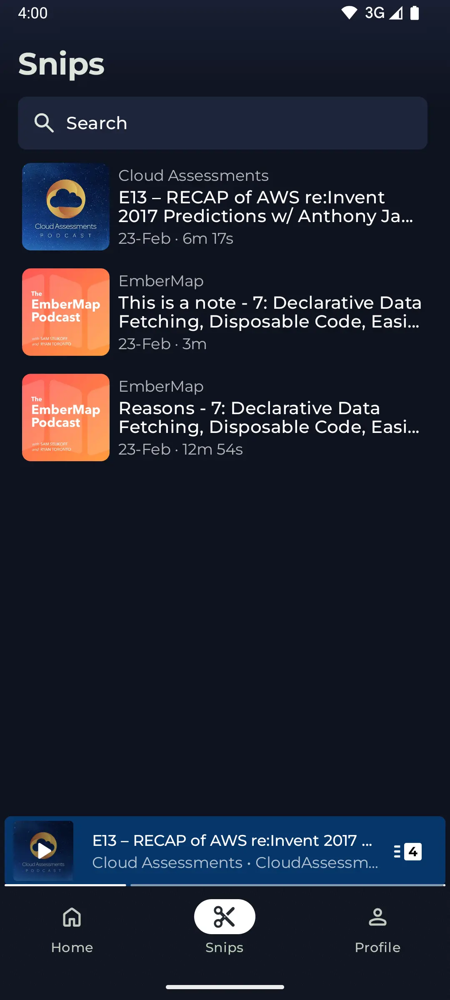
</div>
<div>
  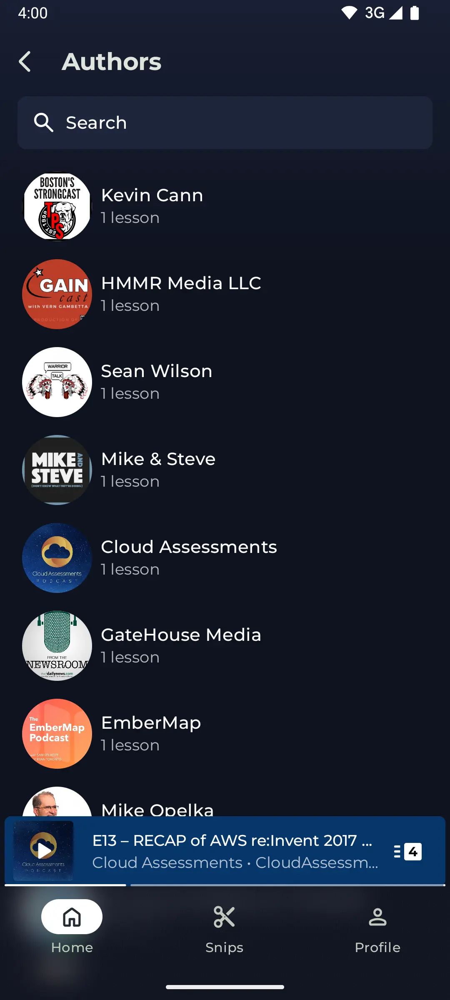
  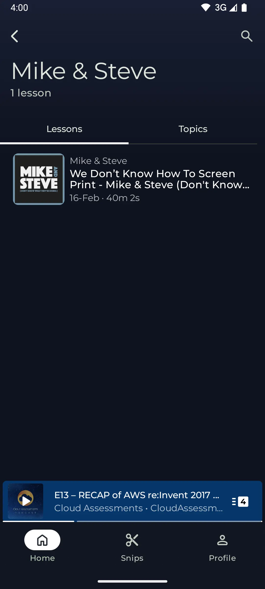
  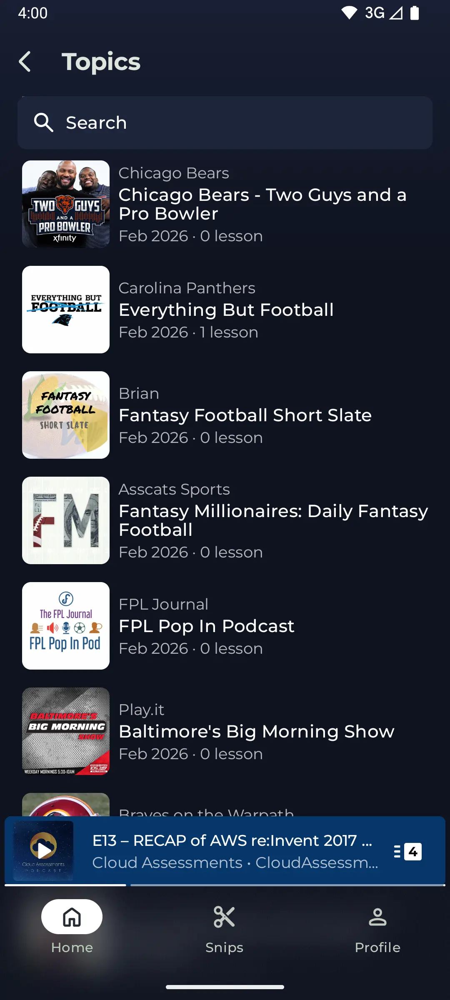
  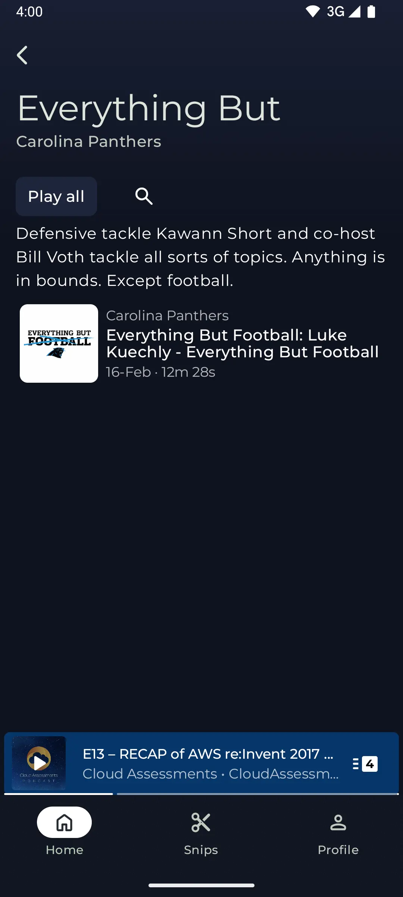
  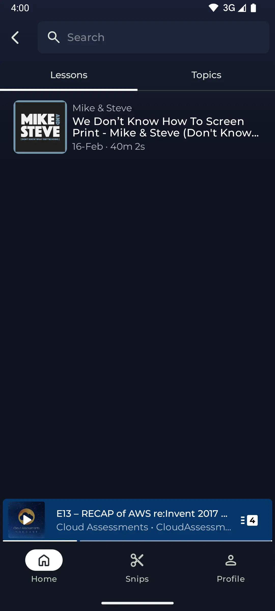
</div>
<div>
  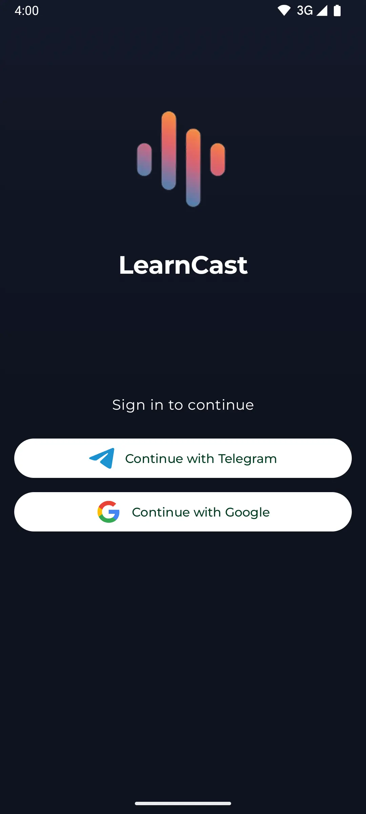
  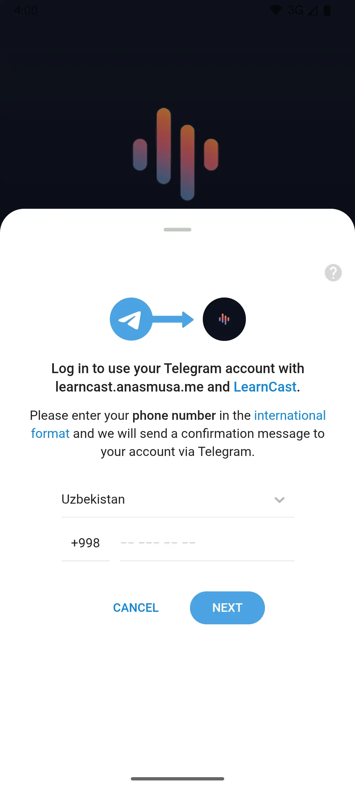
  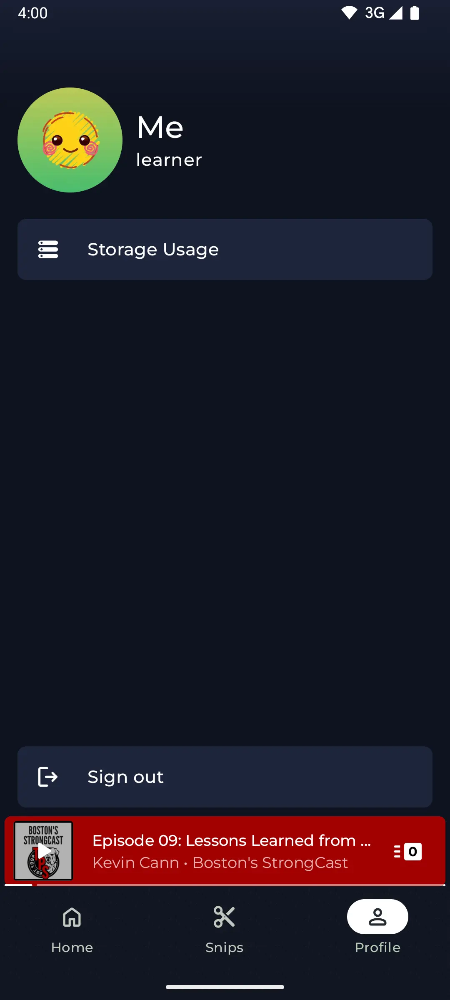
  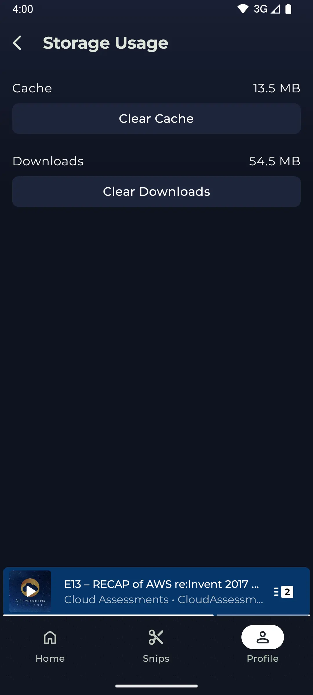
</div>